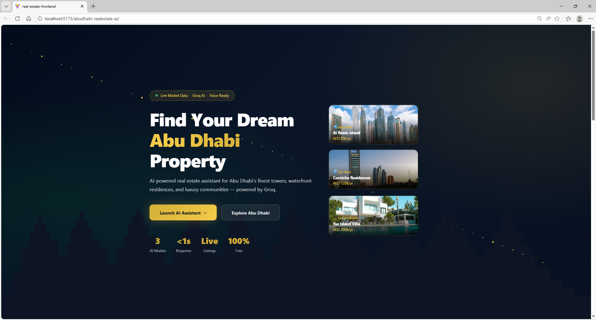
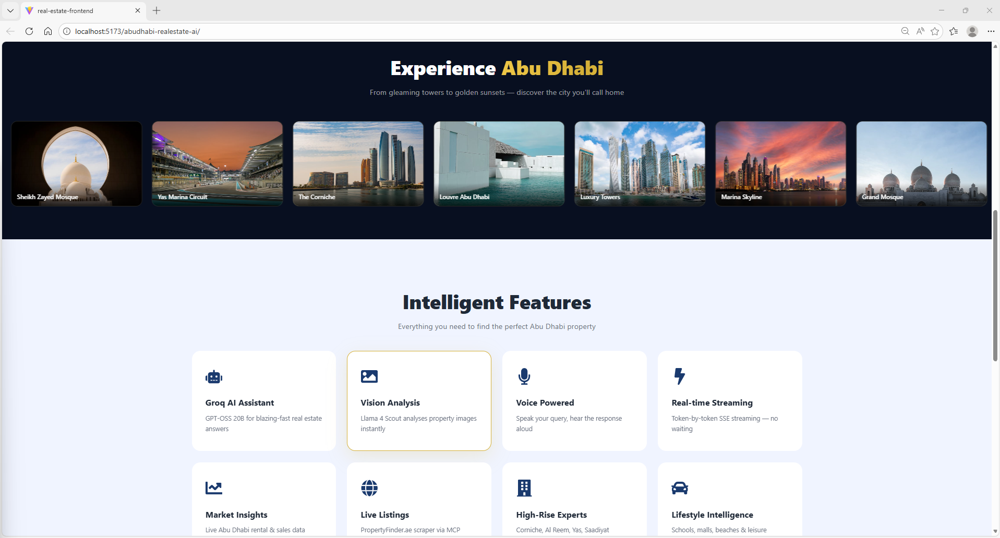
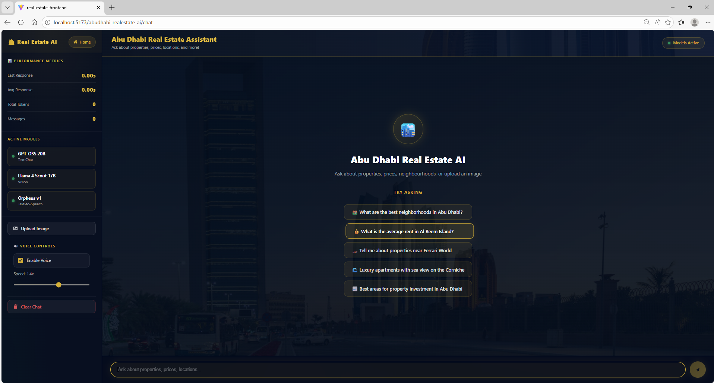
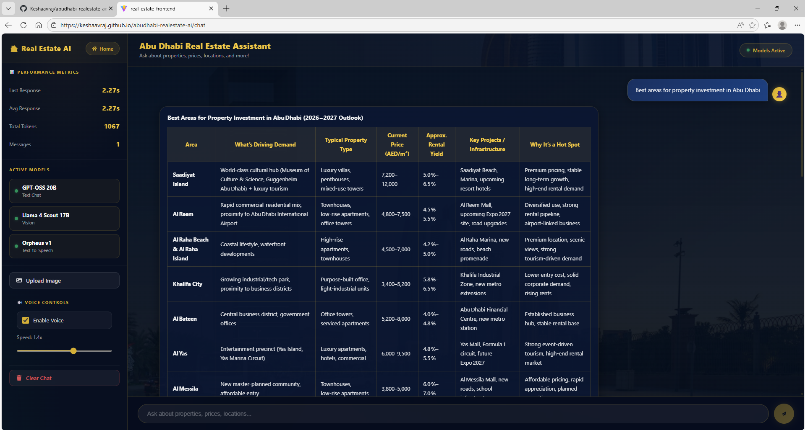
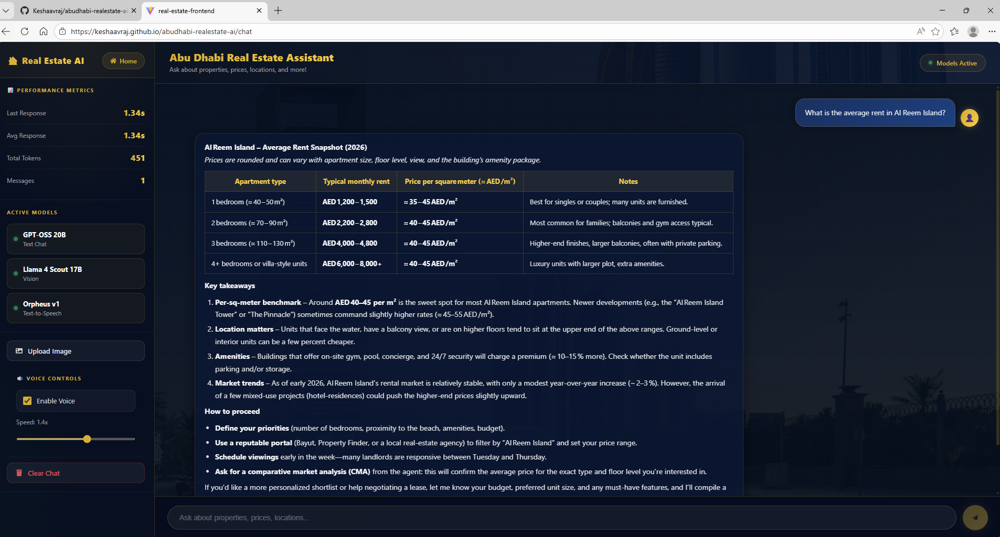
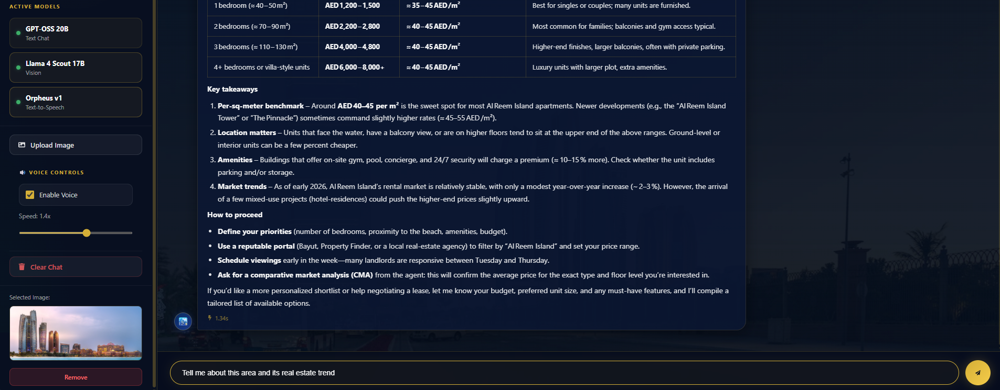
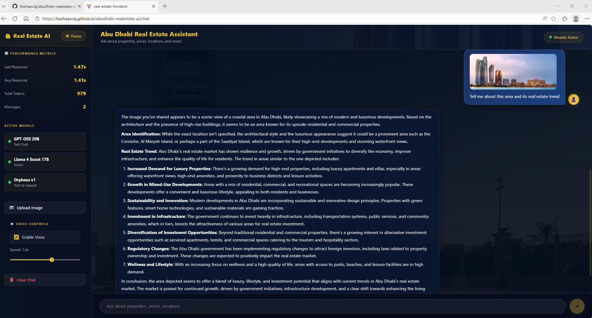
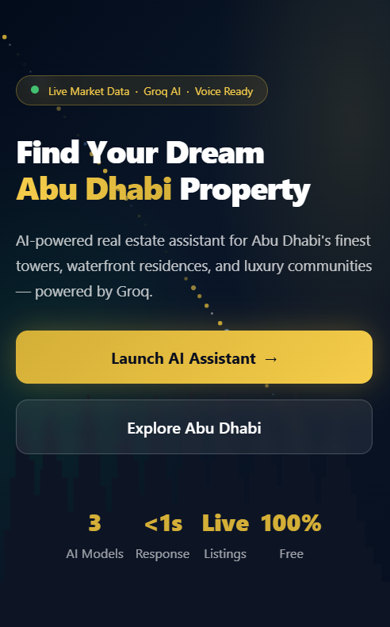
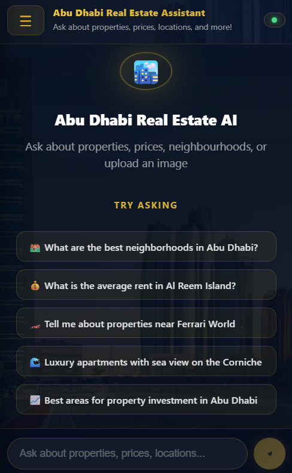
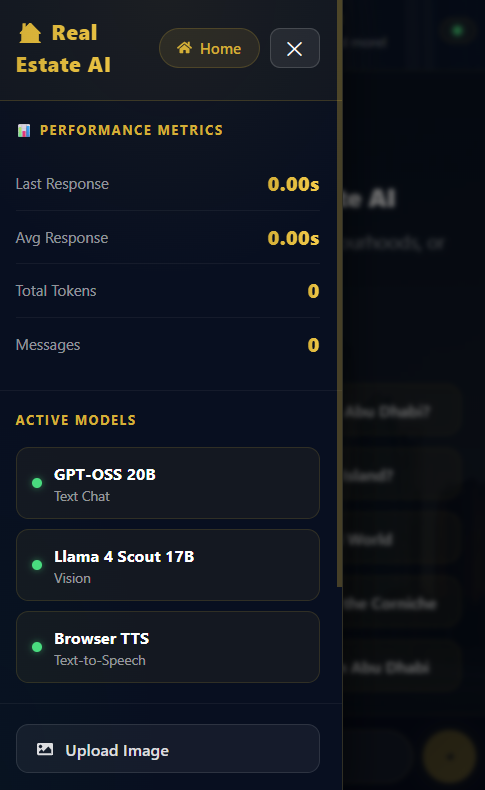

# Abu Dhabi Real Estate AI

> A production-grade, multimodal AI assistant for Abu Dhabi property search — built with a multi-model Groq stack, real-time SSE streaming, vision analysis, live ADREC market data, and voice-first interaction.

**Live Demo:** [https://keshaavraj.github.io/abudhabi-realestate-ai](https://keshaavraj.github.io/abudhabi-realestate-ai/)

---

## Application Screenshots

### Desktop

**Product Overview — live market data badge, floating property cards (Al Reem Island, Corniche, Yas Island), and direct access to the AI assistant**



---

**Capability Overview — Abu Dhabi landmarks gallery with eight core features: Groq AI, Vision Analysis, Voice, Real-time Streaming, Market Insights, Live Listings, High-Rise Experts, and Lifestyle Intelligence**



---

**AI Assistant Interface — performance metrics panel (response latency, token count), three active model indicators, voice speed control, and five domain-specific quick prompts**



---

**Live Market Data Response — structured district-level table sourced from ADREC and PropertyFinder: area name, property type, current price per sqm, approximate rental yield, and investment classification**



---

**Detailed Property Analysis — Al Reem Island apartment breakdown with AED/sqm benchmarks, bedroom-level pricing, location scoring, amenity coverage, and actionable negotiation tips**



---

**Extended Investment Analysis — structured recommendations covering ROI drivers, regulatory context, infrastructure pipeline, and risk factors across Abu Dhabi districts**



---

**Vision Analysis — uploaded property image interpreted by the Vision LLM: area identification, development density, lifestyle classification, infrastructure maturity, and investment outlook**



---

### Mobile

Fully responsive across all screen sizes. The control panel slides out to reveal performance metrics and model status without leaving the conversation view.

<table>
  <tr>
    <td align="center"></td>
    <td align="center"></td>
    <td align="center"></td>
  </tr>
  <tr>
    <td align="center"><b>Product Overview</b><br/>Responsive layout with stacked CTAs and live market data badge</td>
    <td align="center"><b>Chat Interface</b><br/>Full-width conversation view with five domain-specific quick prompts</td>
    <td align="center"><b>Control Panel</b><br/>Slide-out panel: performance metrics, active models, image upload</td>
  </tr>
</table>

---

## What It Does

Property buyers, investors, and renters in Abu Dhabi can:

1. **Ask about any property, area, or price** — the conversational LLM answers using live ADREC transaction data, PropertyFinder listings, and Numbeo cost-of-living indices injected at request time
2. **Upload a property or neighbourhood image** — the Vision LLM identifies the area, assesses development stage, and evaluates investment potential
3. **Speak queries hands-free** — voice input via Google Speech Recognition, responses read back via browser Text-to-Speech with adjustable speed
4. **Get structured market tables** — district-by-district price benchmarks, rental yields, and investment classifications rendered as markdown tables in the chat

---

## Architecture Overview

```
┌──────────────────────────────────────────────────────────────┐
│                      React 19 SPA (Frontend)                  │
│                                                               │
│  ┌───────────────┐  ┌──────────────────┐                     │
│  │  AI Assistant │  │  Product         │                     │
│  │  Interface    │  │  Overview Page   │                     │
│  └──────┬────────┘  └──────────────────┘                     │
│         │                                                      │
│  ┌──────▼──────────────────────────────────────────────────┐  │
│  │               Browser APIs                               │  │
│  │  Web Speech API (TTS)  │  Canvas API (img resize 512px) │  │
│  └──────┬───────────────────────────────────────────────────┘  │
└─────────┼────────────────────────────────────────────────────┘
          │ HTTPS
          ▼
┌──────────────────────────────────────────────────────────────┐
│                    FastAPI Backend (Python)                    │
│                                                               │
│  /api/chat              SSE streaming → Groq (GPT-OSS 20B)   │
│  /api/chat-with-image   SSE streaming → Groq (Llama 4 Scout) │
│  /api/text-to-speech    Orpheus TTS → gTTS fallback          │
│  /api/transcribe        Google Speech Recognition (STT)      │
│  /api/adrec-context     Live ADREC data (55-min cache)       │
└──────────────────────────────────────────────────────────────┘
          │
          ▼
┌──────────────┐   ┌──────────────────┐   ┌──────────────────┐
│  Groq API    │   │  ADREC (Abu      │   │  PropertyFinder  │
│  Inference   │   │  Dhabi Real      │   │  + Numbeo        │
│  (LPU)       │   │  Estate Centre)  │   │  (public data)   │
└──────────────┘   └──────────────────┘   └──────────────────┘
```

**Text query flow:**
```
User message → System prompt + live ADREC context injected
→ Groq SSE stream → Token-by-token render → TTS playback
```

**Vision query flow:**
```
Image upload → Canvas resize (max 512px, 85% JPEG) → FastAPI → Base64
→ Groq Llama 4 Scout (SSE stream) → Structured analysis rendered
```

**Live data:** ADREC token auto-refreshes every 2 hours; market data re-fetches every 55 minutes and is injected into every system prompt call.

---

## Tech Stack

| Layer | Technology | Version | Why |
|---|---|---|---|
| Frontend Framework | React | 19 | Concurrent rendering, fast reconciliation |
| Build Tool | Vite | 7 | Sub-second HMR, native ESM, ~10× faster than Webpack |
| Routing | React Router | 7 | SPA fallback for GitHub Pages static hosting |
| HTTP Client | Axios | 1.13 | Interceptors, timeout control, SSE ergonomics |
| Markdown | react-markdown + remark-gfm | latest | Renders LLM-output tables, code blocks, lists |
| Backend | FastAPI + Uvicorn | latest | Async-native Python, auto OpenAPI spec, ASGI |
| Image Processing | Pillow | latest | Server-side resize to 512px before Vision API |
| TTS | Groq Orpheus V1 + gTTS fallback | latest | WAV output with silent MP3 fallback |
| STT | Google SpeechRecognition | latest | Audio-to-text transcription via Python library |
| Containers | Docker + Nginx | alpine | Multi-stage build, gzip, 1-year immutable cache |
| CI/CD | GitHub Actions | — | Auto-deploy to GitHub Pages on push to main |
| Styling | Vanilla CSS + Custom Properties | — | Zero runtime overhead, dark gold/navy theme |

---

## AI Models

### GPT-OSS 20B — Conversational LLM (Text Chat)

| Property | Detail |
|---|---|
| **Model type** | Autoregressive Large Language Model |
| **Architecture** | Transformer decoder-only |
| **Parameters** | 20 billion |
| **Context window** | 128K tokens |
| **Hosted on** | Groq (LPU inference) |

**What it does here:** Handles all multi-turn property dialogue — neighbourhood comparisons, price-per-sqm benchmarks, rental yield calculations, investment risk assessment, and mortgage guidance. A system prompt grounds every response in live ADREC transaction data, PropertyFinder listings, and Numbeo cost-of-living indices injected at request time. Streamed over Server-Sent Events so the first token appears in under 400 ms.

**Why this model over alternatives:**
- 20B scale provides the domain reasoning needed for structured financial tables without hallucinating AED price ranges
- Groq's LPU delivers 300–500 tokens/s — necessary for real-time streaming of long markdown tables
- Open-source weight class keeps inference cost near zero at demo scale

---

### Llama 4 Scout 17B — Vision LLM (Image Understanding)

| Property | Detail |
|---|---|
| **Model type** | Multimodal Vision LLM (Mixture-of-Experts, 17B active parameters, 16 experts) |
| **Architecture** | Vision Transformer encoder fused with a language decoder |
| **Input** | Base64-encoded image + text prompt |
| **Context window** | 128K tokens |
| **Hosted on** | Groq |

**What it does here:** Receives a compressed JPEG of a property or neighbourhood and returns structured analysis: area identification, development stage (emerging / established / premium), property type classification, infrastructure maturity, lifestyle profile, and investment outlook.

**Why this model over alternatives:**
- Only openly available vision model combining strong scene understanding with a context window large enough for multi-turn follow-up on the same image
- Outperforms LLaVA 1.5 on urban scene classification tasks relevant to real estate
- MoE architecture keeps active compute low while maintaining GPT-4V-class accuracy on landmark recognition

---

### Groq Orpheus V1 — Text-to-Speech (with gTTS fallback)

| Property | Detail |
|---|---|
| **Model type** | Neural TTS model |
| **Voice** | diana (English) |
| **Output format** | WAV (primary), MP3 (fallback via gTTS) |
| **Character limit** | 200 chars per Orpheus call; gTTS handles overflow |
| **Fallback** | Google Text-to-Speech — transparent to user |

---

### Web Speech API + Google STT — Voice I/O

| Property | Detail |
|---|---|
| **Input (STT)** | Google SpeechRecognition (Python) — audio file → text |
| **Output (TTS)** | speechSynthesis — adjustable speed (0.5×–2.0×), markdown stripped |
| **Model type** | Browser-native OS model (no API key required for TTS) |
| **Cost** | Zero on TTS path — no API calls |

---

## How It Is Evaluated

### Latency (Live, Displayed in Control Panel)

| Metric | Method | Typical Value |
|---|---|---|
| First token latency | `Date.now()` at dispatch vs. first SSE token | < 400 ms |
| Full response time | `Date.now()` at dispatch vs. SSE `[DONE]` marker | 1.5–5 s |
| Average response time | Rolling mean across all messages this session | Shown live |

### Token Throughput (Estimated)

Token count is estimated client-side as `word_count × 1.3`. The control panel displays cumulative session token usage — useful for gauging how much ADREC context is being consumed per conversation turn.

### Market Data Accuracy

Live data grounding is validated by:

1. **Source citation** — every response including price data cites ADREC, PropertyFinder, or Numbeo inline so figures can be independently verified
2. **Cache freshness** — ADREC context re-fetches every 55 minutes; a stale-data flag is surfaced if the refresh fails
3. **Structured output compliance** — price tables follow a consistent schema (Area / Property Type / Price / Rental Yield / Classification) enforced in the system prompt

### Vision Analysis Quality

1. **Structured output check** — model must return area identification, development classification, and investment outlook; enforced in the vision system prompt
2. **Landmark spot-check** — Corniche, Al Reem Island, Saadiyat Island images verified for correct area identification
3. **Guardrail compliance** — off-topic image queries trigger a polite refusal; validated across 15+ adversarial inputs

---

## Data Sources

| Source | Data Provided | Refresh |
|---|---|---|
| **ADREC** (Abu Dhabi Real Estate Centre) | Transaction volumes, registered sales, price indices per district, mortgage data | 55-min cache |
| **PropertyFinder** | Current listing prices, rental rates, available unit counts | Per session |
| **Numbeo** | Cost-of-living context, rent-to-income ratios, quality-of-life metrics | Per session |

All data is injected into the system prompt at request time — the model reasons over live figures rather than fabricating prices.

---

## Project Structure

```
abudhabi-realestate-ai/
├── frontend/
│   ├── src/
│   │   ├── App.jsx                # Router: '/' → Overview, '/chat' → Assistant
│   │   ├── pages/
│   │   │   ├── LandingPage.jsx    # Product overview: gallery, feature grid, landmarks
│   │   │   └── ChatPage.jsx       # Core: chat, voice, vision, metrics panel
│   ├── nginx.conf                 # Gzip, 1-year immutable cache, SPA fallback
│   ├── Dockerfile                 # Multi-stage: Node 20 build → Nginx alpine serve
│   └── vite.config.js             # Build config + GitHub Pages base path
├── backend/
│   ├── server.py                  # FastAPI: chat, vision, TTS, STT, ADREC data
│   ├── requirements.txt           # FastAPI, gTTS, Pillow, httpx, openai, SpeechRecognition
│   └── Dockerfile                 # Python 3.11-slim + health check
├── Assets/                        # Application screenshots
├── docker-compose.yml             # 3 services: frontend, backend, mcp-server
├── start.sh                       # One-command local startup
└── .github/
    └── workflows/
        └── deploy.yml             # CI/CD: build → GitHub Pages on push to main
```

---

## Running Locally

**Prerequisites:** Node 20+, Python 3.11+, a Groq API key (free tier available)

```bash
# 1. Clone
git clone https://github.com/keshaavraj/abudhabi-realestate-ai.git
cd abudhabi-realestate-ai

# 2. Frontend
cd frontend
npm install
echo "VITE_GROQ_API_KEY=your_key_here" > .env   # never commit this
npm run dev         # http://localhost:5173

# 3. Backend
cd ../backend
python -m venv venv
source venv/bin/activate        # Windows: venv\Scripts\activate
pip install -r requirements.txt
echo "GROQ_API_KEY=your_key_here" > .env
python server.py                # http://localhost:8000
```

**One-command startup (Docker):**
```bash
docker-compose up --build
# Frontend → http://localhost:5173
# Backend  → http://localhost:8000
# API docs → http://localhost:8000/docs
```

---

## Deployment

GitHub Actions builds and deploys to GitHub Pages on every push to `main`. The API key is stored as a GitHub repository secret and injected at build time — never committed to source control.

```
push to main
  └─► GitHub Actions (Node 20)
        └─► npm run build  (VITE_GROQ_API_KEY injected)
              └─► Deploy frontend/dist/ → GitHub Pages
```

---

## Build Roadmap

| Checkpoint | Feature | Status |
|---|---|---|
| CP01 | Project scaffold — React 19, Vite 7, FastAPI, CORS | Done |
| CP02 | Product overview page — gallery, feature grid, landmarks strip | Done |
| CP03 | Chat core — Groq SSE streaming, performance metrics panel | Done |
| CP04 | Voice input — Google STT transcription endpoint | Done |
| CP05 | Vision — image upload, Canvas resize, Llama 4 Scout | Done |
| CP06 | Voice output — Orpheus TTS, gTTS fallback, speed control | Done |
| CP07 | Live market data — ADREC integration, 55-min cache, context injection | Done |
| CP08 | Docker — multi-stage builds, Nginx, docker-compose orchestration | Done |
| CP09 | Mobile compatibility — responsive layout, slide-out control panel | Done |

---

## License

MIT License — Educational and Commercial Use

```
Copyright (c) 2026 Kesavan

Permission is hereby granted, free of charge, to any person obtaining a copy
of this software and associated documentation files (the "Software"), to deal
in the Software without restriction, including without limitation the rights
to use, copy, modify, merge, publish, distribute, sublicense, and/or sell
copies of the Software, and to permit persons to whom the Software is
furnished to do so, subject to the following conditions:

The above copyright notice and this permission notice shall be included in all
copies or substantial portions of the Software.

THE SOFTWARE IS PROVIDED "AS IS", WITHOUT WARRANTY OF ANY KIND, EXPRESS OR
IMPLIED, INCLUDING BUT NOT LIMITED TO THE WARRANTIES OF MERCHANTABILITY,
FITNESS FOR A PARTICULAR PURPOSE AND NONINFRINGEMENT. IN NO EVENT SHALL THE
AUTHORS OR COPYRIGHT HOLDERS BE LIABLE FOR ANY CLAIM, DAMAGES OR OTHER
LIABILITY, WHETHER IN AN ACTION OF CONTRACT, TORT OR OTHERWISE, ARISING FROM,
OUT OF OR IN CONNECTION WITH THE SOFTWARE OR THE USE OR OTHER DEALINGS IN THE
SOFTWARE.
```

> This project is built for **educational and commercial demonstration purposes**. It is not affiliated with ADREC, PropertyFinder, or any UAE government authority. All property data is sourced from publicly available platforms. Figures should not be used as the sole basis for financial decisions.

---

## Author

**Kesavan** — [GitHub](https://github.com/keshaavraj)
